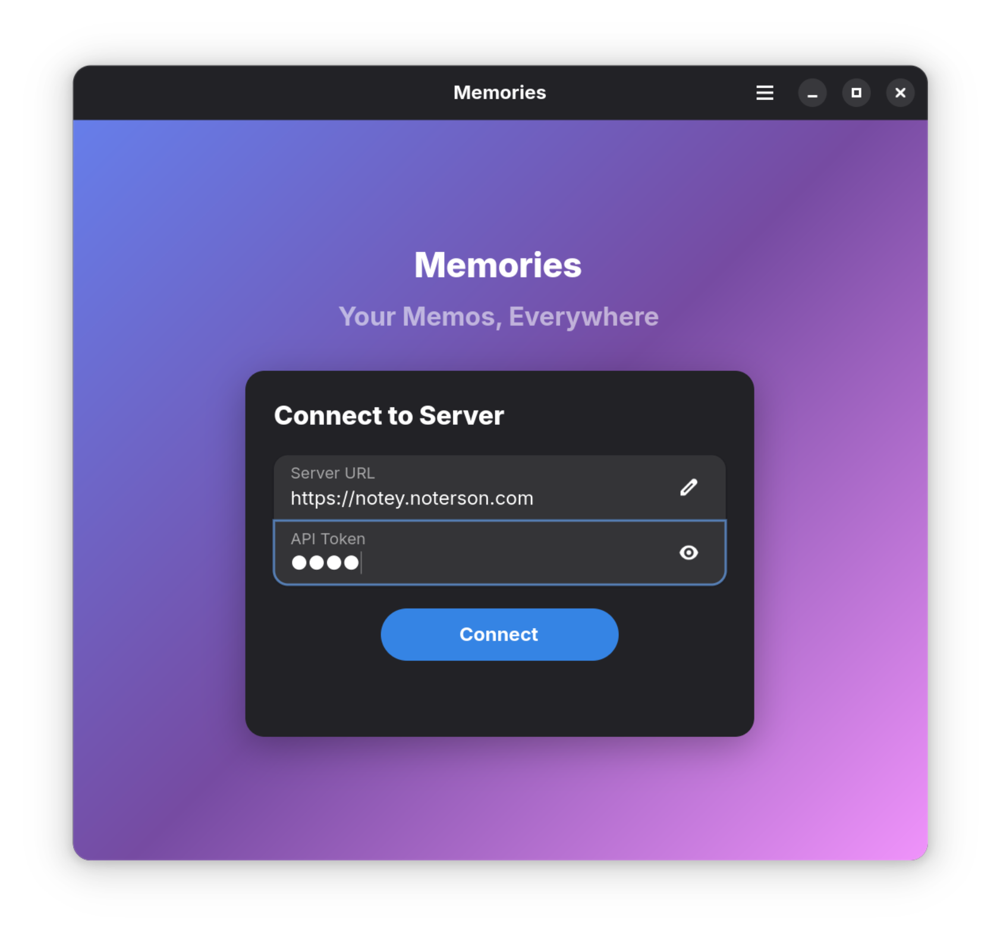
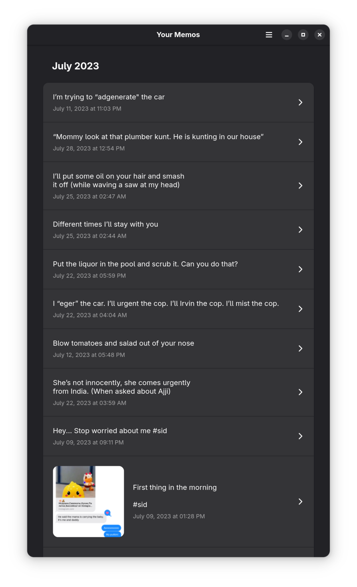

# Memories

A native GNOME client for [Memos](https://usememos.com/) - because your notes deserve a proper desktop home.

## Screenshots
<p align="center">
  <p></p>
  <p></p>
</p>

## Status

**Work in Progress** - Built with love for the Memos ecosystem.

## Features

- 🔐 Bearer token authentication
- 📝 Browse and search your memos
- 🖼️ Image thumbnail previews
- ♾️ Infinite scroll pagination
- 🎨 Native GNOME/Adwaita design

## Stack

- Python + GTK4 + libadwaita
- Flatpak packaging

## Building
```bash
flatpak-builder --user --install --force-clean build-dir org.quasars.memories.json
```

## Running
```bash
flatpak run org.quasars.memories
```

## Todo

- [ ] Create/edit/delete memos
- [ ] Tag filtering
- [ ] Full memo detail view
- [ ] Markdown rendering

## License

GPL-3.0-or-later
